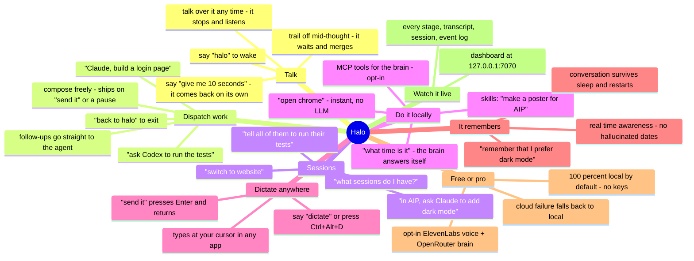

# Halo

Voice front-end for agentic coding tools. Say a wake word, talk to
Claude Code or Codex CLI in plain English, and hear the result back.
Halo is the audio layer; the agents do the work.

Status: **v1.7 — seamless conversation.** Halo now behaves like a partner in a
spoken conversation: it takes its turn back when it promises one ("give me ten
seconds"), ignores your counting and side-talk, **never loses what you say
while it's busy**, doesn't cut you off mid-thought, and understands accented
speech far better (large-v3-turbo + context-aware transcript repair). Plus
dictation on a global hotkey (**Ctrl+Alt+D**), skills routing, MCP tools for
the brain itself, and real time-awareness. Builds on v1.6 (bulletproof
talk-over), v1.3 (conversation + dictate-anywhere), v1.2 (multi-session), v1.1
(custom wake word). Live web dashboard at `http://127.0.0.1:7070`.

See [CHANGELOG.md](./CHANGELOG.md) for the full history. Licensed MIT
([LICENSE](./LICENSE)).

### What's new in v1.7

- **It gets a turn, you get yours** — say *"give me ten seconds"* and count;
  Halo waits and then comes back on its own. Counting, thinking-aloud, and
  talking to someone else in the room are classified against the actual mic
  signal and dropped instead of dispatched as commands.
- **Nothing you say is lost** — the mic keeps listening *between* turns (while
  Halo routes, thinks, or replies) and feeds that speech into the next turn.
  If you resume talking while it's transcribing, it holds the commit instead
  of cutting you off.
- **Better ears** — STT upgraded to `large-v3-turbo` (much better on accents),
  quiet-mic gain fixed, and a low-confidence transcript is repaired by the
  brain using the conversation context ("make sure it makes sense, not just
  random words").
- **Compose, then send** — in direct dialogue your words accumulate and only
  ship on *"send it"* / *"go"* / *"that's it"* or a clear pause. No more
  half-sentences fired at the agent.
- **Dictation hotkey** — **Ctrl+Alt+D** starts dictate-anywhere even while
  Halo is asleep in wake-listening.
- **Skills, MCP, time** — Claude/Codex skills discovered at startup and routed
  by phrase ("make a poster for AIP"); the brain can call MCP tools itself
  (opt-in); and it knows real dates/durations, so "how long have we been
  working on this?" gets a true answer.

### The map — how you use it and why it's great



### Cheat sheet — everything you can say (and press)

One keyboard shortcut, everything else is your voice:

| Shortcut | Effect |
|---|---|
| **Ctrl+Alt+D** | Start dictate-anywhere from anywhere (even while Halo sleeps). Configurable: `[dictation] hotkey`. |

| You say | What happens |
|---|---|
| **Wake & sleep** | |
| *"halo"* | wake up, start a conversation |
| *"goodbye"* / *"go to sleep"* / *"over and out"* | end the conversation |
| *"new task"* / *"start over"* / *"fresh session"* | reset agent sessions |
| **Give agents work** | |
| *"Claude, build a login page"* | dispatch to Claude (no LLM round-trip) |
| *"ask Codex to run the tests"* / *"tell Claude to fix it"* | verbal dispatch |
| *"now also add tests"* | follow-up straight to the active agent |
| *"send it"* / *"go"* / *"that's it"* | ship the message you've been composing |
| *"back to halo"* / *"talk to me"* | leave the agent, back to Halo |
| **While Halo talks** | |
| *"stop"* / *"wait"* / *"hold on"* | Halo shuts up immediately |
| just start talking | talk-over: it stops and routes what you said |
| **Pace the conversation** | |
| *"give me ten seconds"* / *"hold on"* | Halo waits, then takes its turn back |
| trail off mid-sentence… | Halo holds the fragment and merges your continuation |
| **Sessions & navigation** | |
| *"what sessions do I have?"* / *"where am I?"* | spoken session list / active one |
| *"switch to website"* / *"work on the AIP one"* | change active session |
| *"in website, ask Claude to add dark mode"* | one-shot dispatch elsewhere |
| *"go back"* / *"the other one"* | return to the previous session |
| *"tell all of them to run their tests"* | fanout to every session |
| **Status & results** | |
| *"what's happening?"* / *"are you done?"* | job status, no LLM |
| *"what did Claude say?"* | replay the last result |
| *"open landing.html"* | open what the agent just built |
| **Local & utility** | |
| *"open chrome"* / *"launch calculator"* | instant local tools |
| *"dictate"* | dictate-anywhere (see table above for the hotkey) |
| *"say thanks for watching"* | Halo speaks it verbatim |
| *"remember that I prefer dark mode"* | stored as a durable fact |
| *"what skills do you have?"* | list discovered Claude/Codex skills |
| *"when did we start?"* / *"how long has this taken?"* | real time-aware answers |

Dictation-mode phrases (*"new line"*, *"send it"*, *"stop"*) are in
[Dictation](#dictation); multi-session phrasing in
[Multi-session mode](#multi-session-mode).

### v1.3 highlights

- **Real conversation, not just dispatch** — chit-chat and casual questions get an actual spoken reply from the brain (streaming, so it starts talking in ~0.4 s), and Halo **remembers the conversation across sleep/wake** so "what did we just do?" works. It does simple things itself (open apps, answer, "say this out loud") and **confirms before ever handing work to Claude** — it won't silently spawn an agent unless you name it.
- **Dictate-anywhere (Windows)** — say *"dictate"*, click into any text field (browser, editor, terminal), and your speech is typed where the cursor is, with real-time accent-aware cleanup. Say *"send it"* to submit and drop back into conversation. See [Dictation](#dictation).
- **Per-machine wake calibration** — `halo calibrate` measures your actual mic + voice and writes tuned wake settings into a `[profiles.<hostname>]` block, so the same config adapts to each PC. A second STT pass also **verifies the wake word** to kill false fires. See [Wake word](#custom-wake-word).
- **Desktop control via MCP (opt-in)** — say *"Claude, take a screenshot and open Notepad"* and the spawned Claude session can drive your desktop (Windows-MCP). See [Desktop control](#desktop-control-mcp).
- **Paid provider options (opt-in)** — keep it 100% local, or switch TTS to **ElevenLabs** and the brain to **OpenRouter** via env vars. See [Providers](#providers-local-or-cloud).
- **New dashboard** — a React/Three.js "command mode" UI (source in `dashboard/`), now **mobile-responsive** and it **reuses your open tab** across restarts instead of spawning new ones.

The dashboard shows the entire pipeline live: which stage is firing
(wake / record / transcribe / route / agent / voice), the most recent
transcript, every agent session by Roman name with state and elapsed
time, and a color-coded event log. Auto-launches in your default
browser the first time you run Halo (set `HALO_NO_BROWSER=1` to
suppress); on later restarts it reuses the already-open tab.

```
HALO •  LOCAL  •  listening                            live  ·  v1.1
─────────────────────────────────────────────────────────────────────
[wake] → [record] → [transcribe] → [route] → [agent] → [voice]
─────────────────────────────────────────────────────────────────────
  TRANSCRIPT                            │  AGENTS         1 running
                                        │  Mercury · claude  RUNNING 23s
   "Claude, build me a one-line         │    "build me a hello..."
    python script that prints hello"    │
                                        │  Neptune · codex   IDLE
   ● Mercury — I wrote it to hello.py.  │
─────────────────────────────────────────────────────────────────────
  EVENT LOG                                              ● LIVE
  14:23:01  wake.fired       score 0.83
  14:23:03  record.opened
  14:23:04  stt.done         620ms  "Claude, build me a..."
  14:23:04  route.matched    vocative -> claude_code
  14:23:04  agent.dispatched Mercury starting
  14:23:12  agent.streaming  Mercury: I wrote it to hello.py.
  14:23:13  tts.spoke        Halo: I wrote it to hello.py.
  14:23:13  agent.done       Mercury  (8s)
```

```
You: "halo. Claude, write a one-line python script that prints hello."
Halo: "On it. I'm calling this session Mercury."
        ... a separate PowerShell window pops up live-tailing Claude
            (text deltas, tool calls, result events) so you can watch
            Claude work without scrolling Halo's own terminal
        ... Mercury speaks: "I wrote it to hello dot py."

You: "now make it print goodbye instead."
        ... same Mercury session (persistent process, no spawn cost)
        ... gate: continuation marker matched, sent
Halo: "Done."

[phone rings]
You: "hey John, want to grab lunch?"
        ... gate: side_conversation pattern matched, dropped silently
        ... dashboard logs it; Mercury never sees it

You: "ask Codex to refactor it into a function."
        ... verbal-dispatch regex catches this, skips Stage 2 LLM
Halo: "On it. I'm calling this session Neptune."

You: "back to halo. open hello.py."
Halo: "Opened hello.py."

You: "end session."
Halo: "Goodbye."
```

100% local out of the box (Ollama + faster-whisper + Kokoro). No API
keys required to run Halo — the agents themselves (Claude Code / Codex)
authenticate against their own services.

---

## Stack

| Layer        | Tech                                              | Notes |
|--------------|---------------------------------------------------|-------|
| Wake word    | [openWakeWord](https://github.com/dscripka/openWakeWord) + custom `halo.onnx` (trained via [bbarrick/wakeword_trainer](https://github.com/bbarrick/wakeword_trainer)) | Single-word "halo" wake (188 positives × 22 voices + 524 negatives via ElevenLabs TTS, F1 = 0.80). silero-VAD gate on top via `vad_threshold=0.7`. Falls back to builtin `hey_jarvis` if `halo.onnx` is missing. |
| Mic          | [sounddevice](https://python-sounddevice.readthedocs.io/) | 16 kHz mono int16 |
| VAD          | [silero-vad v5](https://github.com/snakers4/silero-vad)   | 600 ms base silence, mode-adaptive extensions |
| STT          | [faster-whisper](https://github.com/SYSTRAN/faster-whisper) + large-v3-turbo | int8_float16 on CUDA, ~500 ms per utterance; multilingual-trained (better on accents); auto-falls back to distil-large-v3; `HALO_STT_MODEL` to override |
| Router       | [Ollama](https://ollama.com) + `qwen2.5:1.5b-instruct`    | Stage 2 LLM, fires only when no local handler matches |
| TTS          | [Kokoro-82M](https://huggingface.co/hexgrad/Kokoro-82M) ONNX (fp16) | `af_heart` voice, sanitized for Markdown |
| Agents       | [Claude Code](https://github.com/anthropics/claude-code) + [Codex CLI](https://github.com/openai/codex) subprocesses | Persistent sessions; voice-mode flags (`--permission-mode bypassPermissions` / `approval_policy="never"`) so no manual approvals |

Hardware target: Windows + NVIDIA GPU (RTX 3060 is enough). Mac /
Linux paths exist for tools and TTS; CUDA-specific bits gracefully
fall back to CPU.

### v1.2 highlights

- **Hybrid streaming + one-sentence reply summaries (v1.2.1)** —
  Streaming agents (Claude) speak the **first 2 sentences live** as
  they're generated, so you immediately know the agent is alive and
  working. After that, Halo stops speaking and silently buffers the
  rest. When the agent finishes, if the reply ran past the live budget
  Halo sends the remainder through the brain (qwen2.5:1.5b) for a
  one-sentence cap: *"And, I added bcrypt password verification to auth
  dot py and wired it into login user."* For batch agents (Codex),
  same idea — speak short replies as-is, summarize when long
  (> 400 chars). Tunable via `LIVE_STREAM_MAX_SENTENCES` and
  `REPLY_SUMMARIZE_THRESHOLD_CHARS` in `halo/config.py`. The full
  reply still prints to your terminal so nothing's lost — TTS is
  just the summary.
- **Multi-session mode (v1.2.0)** — Halo runs a process discovery
  scanner that finds every `claude` / `codex` session on your machine
  and feeds the list to the routing brain. You no longer talk to one
  Claude bound to Halo's launch dir — you talk to **whichever session
  you name**. Voice commands:
  - *"switch to website"* / *"work on the AIP one"* → set active session
  - *"what sessions do I have?"* → spoken list
  - *"where am I?"* / *"what project am I on?"* → speak the active one
  - *"in website, ask Claude to add dark mode"* → one-shot dispatch to
    another session without changing the active one
  - *"tell all of them to run their tests"* → fanout to every session
  Each project gets its own persistent Claude subprocess (LRU-bounded),
  so the same agent can have parallel jobs across N projects at once.
  Brain decisions live in the Stage 2 LLM prompt — no new regex.
  See [Multi-session mode](#multi-session-mode) below.
- **Follow-up gate (v1.1.1)** — once you're in direct dialogue with an
  agent, the mic stays hot for follow-ups but a 4-rule keyword filter
  decides whether each utterance is actually for the agent. Phone calls,
  side conversations to colleagues, and your own muttering get silently
  dropped instead of being dispatched to Claude. See
  [Follow-up gate](#follow-up-gate) below for the rules. Toggle with
  `FOLLOWUP_GATE_ENABLED` in `halo/config.py`.
- **Custom "halo" wake word** — single-word wake ("halo" alone fires
  it, no "hey" prefix needed). Trained on RTX 3060 in ~30 min via
  bbarrick's wakeword_trainer + ElevenLabs free-tier TTS.
- **Persistent Claude sessions** — one long-lived `claude -p
  --input-format stream-json` process per session, kept alive across
  every voice turn. Kills the per-turn-subprocess race that caused
  `exit None` failures and "starting session" duplicates.
- **Separate-console live feed** — when you dispatch to Claude, a
  PowerShell window pops up tailing the session log. You watch Claude's
  text deltas, tool calls, and result events in real time, while
  Halo's own terminal stays clean. Toggle with
  `AGENT_CLI_VISIBLE = False` in `halo/config.py`.
- **Noise suppression pipeline** — three layers: mic noise gate
  (`MIC_NOISE_GATE_RMS = 0.005`), wake silero-VAD gate
  (`vad_threshold = 0.7`), Whisper internal VAD filter
  (`vad_filter=True`). Plus a residual STT hallucination filter for
  Whisper's "Thank you" / "you" / "hello" artifacts on silence.
  Crank sensitivity in one move with `HALO_HOT_MIC=1`, or tune each knob
  via `HALO_VAD_THRESHOLD` / `HALO_SPEECH_RMS_FLOOR` /
  `HALO_ENERGY_ONSET_CHUNKS` / `HALO_MIC_NOISE_GATE`.
- **Talk-over (barge-in capture)** — interrupt Halo mid-reply and it stops +
  routes what you said. ON by default; safe without echo-cancelling hardware
  thanks to layered echo guards (loudness gate + word-overlap + min-words).
  Loudness floor `HALO_BARGE_IN_MIN_RMS` (default 0.045, auto-relaxed for AEC
  mics); disable with `HALO_BARGE_IN_CAPTURE=0`.
- **Fuzzy-fallback dispatcher** — when Ollama's down AND you said an
  agent name (even Whisper-mangled as "Cloud" / "Codec"), dispatches
  to that agent directly instead of giving up.
- **`halo doctor`** — diagnose Ollama, agent CLIs, Kokoro models.

---

## Install

### 1. Halo itself

```powershell
python -m venv .venv
.venv\Scripts\Activate.ps1
pip install git+https://github.com/VW3st/halo.git
```

(PyPI release coming — `pip install halo-voice` will work once published.)

On a Windows machine with an NVIDIA GPU, also grab the CUDA wheels for
faster-whisper:

```powershell
pip install "halo-voice[gpu-windows] @ git+https://github.com/VW3st/halo.git"
```

`silero-vad` pulls PyTorch (~800 MB). To save bandwidth on a CPU-only
laptop, install Torch CPU-only first:

```powershell
pip install torch --index-url https://download.pytorch.org/whl/cpu
pip install git+https://github.com/VW3st/halo.git
```

### 2. Kokoro TTS model files (~200 MB)

```powershell
halo download-models
```

Drops `kokoro-v1.0.fp16.onnx` + `voices-v1.0.bin` into `~/.halo/models/`
(or `./models/` if you're running from a git checkout). Without these,
Halo runs in silent (text-only) mode.

The other models download themselves on first use:
- openWakeWord pretrained ONNX (~few MB)
- silero-vad model (~2 MB)
- faster-whisper large-v3-turbo (~1.6 GB, from HuggingFace; falls back to
  distil-large-v3 if it can't load — override with `HALO_STT_MODEL`)

### 3. Ollama + routing model

Install Ollama from <https://ollama.com/download>, then:

```powershell
ollama pull qwen2.5:1.5b-instruct
```

Ollama auto-starts a background service on `localhost:11434`. Halo
talks to it over HTTP.

**Why `qwen2.5:1.5b-instruct`?** Non-reasoning, ~1.5 GB, hits sub-100 ms
on a warm KV cache. Reasoning models (qwen3, deepseek-r1) emit `<think>`
tokens and blow the per-turn budget to 20 s+. Optional alternatives via
`OLLAMA_MODEL` in `halo/config.py`: `qwen2.5:3b-instruct` (better
accuracy, ~3× slower), `qwen2.5:7b-instruct` (best accuracy, needs more
VRAM).

### 4. Coding agents (Claude Code and/or Codex CLI)

Install whichever you want Halo to dispatch to. At least one is needed
unless you only plan to use local tools.

```powershell
# Claude Code (requires Anthropic auth — `claude login` once)
npm install -g @anthropic-ai/claude-code

# Codex CLI (requires OpenAI auth — `codex login` once)
npm install -g @openai/codex
```

Both must be on PATH. Verify with `claude --version` and `codex --version`.

---

## Run

```powershell
halo
```

(or `python -m halo` if you cloned the repo directly.)

You'll see preload messages, then `Halo ready. Say the wake word...`
and hear `"Halo online."` Speak the wake word ("Hey Jarvis"), then
your command.

`halo` always uses the current working directory as Claude/Codex's
project root, so `cd` into your project before launching. Override
the model location with `HALO_MODELS_DIR=/path/to/models`.

### CLI

```
halo                  start the voice loop (default)
halo run              same as above
halo download-models  fetch Kokoro TTS model files
halo doctor           check Ollama, agents (claude/codex), models — read-only
halo calibrate        tune the wake word to this machine's mic + your voice (v1.3)
halo sessions         list running coding-agent sessions on this machine (v1.2)
halo version          print installed version
halo --help           show help
```

(`python -m halo <command>` also works, e.g. `python -m halo calibrate`.)

`halo doctor` is the first thing to run after install. It probes every
external dependency (Ollama running + routing model pulled, Claude CLI
on PATH and responsive, Codex CLI on PATH and responsive, Kokoro model
files present) and prints the exact install command for anything that's
missing. It never installs or modifies anything itself.

### Dev install

Clone the repo and install editable:

```powershell
git clone https://github.com/VW3st/halo.git
cd halo
python -m venv .venv
.\.venv\Scripts\Activate.ps1
pip install -e .[gpu-windows,dev]
python -m halo
```

---

## Providers (local or cloud)

Halo runs **100% local by default** (Ollama brain + faster-whisper STT +
Kokoro TTS), no API keys. You can opt into paid providers per-component via
environment variables (a `.env` in the project root is auto-loaded; copy
`.env.example`). Keys live ONLY in `.env`, which is gitignored:

```bash
# Cloud TTS (ElevenLabs)
HALO_VOICE_PROVIDER=elevenlabs
ELEVENLABS_API_KEY=...                 # your key — never commit
HALO_ELEVENLABS_VOICE_ID=...

# Cloud brain (OpenRouter) for routing + chat
HALO_ROUTER_PROVIDER=openrouter
OPENROUTER_API_KEY=...                  # your key — never commit
HALO_OPENROUTER_MODEL=ibm-granite/granite-4.1-8b
# Optional: a SMARTER model for conversation only (routing stays fast/cheap)
HALO_OPENROUTER_CHAT_MODEL=anthropic/claude-3.5-haiku
```

Mix and match — e.g. local brain + ElevenLabs voice, or cloud brain + Kokoro.

## Dictation

System-wide dictate-anywhere (Windows). Say **"dictate"** — or press
**Ctrl+Alt+D** from anywhere, even while Halo is idle in wake-listening
(configurable via `[dictation] hotkey` / `HALO_DICTATION_HOTKEY`) — click into
any text field (browser, editor, terminal — anywhere the caret blinks), and
speak; your words are typed at the cursor via `SendInput` Unicode injection,
with real-time accent-aware cleanup. Controls (spoken):

| Say | Effect |
|---|---|
| *"new line"* / *"new paragraph"* | line break(s), keep dictating |
| *"period"* / *"comma"* / *"question mark"* … | punctuation |
| *"send it"* / *"send the message"* / *"enter"* | press Enter (submit) **and** return to conversation |
| *"back to the session"* / *"back to Halo"* / *"exit"* | leave dictation (no Enter) and resume the conversation — back with whatever agent you were talking to |
| *"stop"* / *"smart stop"* | end dictation |

Tunables under `[dictation]` in config: `silence_ms`, `auto_period`,
`autocorrect`, `start_phrases`, `stop_phrases`.

## Desktop control (MCP)

Opt-in: let the Claude sessions Halo spawns drive your desktop (screenshots,
clicking, typing, app/window control) via [Windows-MCP](https://github.com/CursorTouch/Windows-MCP).
Say *"Claude, take a screenshot and open Notepad and type hello"*. One-time
setup: `pip install uv`, then set `[mcp] enabled = true` (config) — Halo writes
`~/.halo/mcp.json` and launches the server on first use.

⚠️ Powerful: Claude drives your machine by voice with **no approval prompts**.
Off by default. Restrict with `--exclude-tools` in `~/.halo/mcp.json`.

## Memory

Halo keeps a **persistent, local memory** (`halo/memory.py`, SQLite at
`~/.halo/halo_memory.db`) so it remembers across sleep/wake **and** restarts —
no more "what was the last command?" amnesia. Three tiers:

- **Short-term** — recent turns (this + the last few sessions), injected into
  the brain every turn so *"what did you open first?"* / *"the other one"* resolve.
- **Long-term** — all turns, kept for `retention_days` (default 30) then pruned.
- **Important facts** — durable, never pruned. Captured two ways:
  - **Explicitly:** *"remember that I'm working on the bakery site"* → stored.
  - **Automatically:** salient statements (*"I'm working on …"*, *"I prefer …"*,
    *"every day I …"*) are auto-kept as facts (project / preference / routine).

Each turn, a compact `# MEMORY` block (top facts + recent/relevant turns) is fed
to the routing brain and the chat model — entirely local, nothing leaves the
machine. Config under `[memory]`: `enabled`, `path`, `retention_days`,
`max_turns`, `max_facts` (or `HALO_MEMORY_ENABLED=0` to turn off).

> Roadmap: the retrieval is keyword + recency today; the interface is built so a
> vector/graph backend (e.g. [Mem0](https://github.com/mem0ai/mem0)) can drop in
> for semantic recall without changing callers.

## How conversations work

Once a wake word fires, you enter a **conversation** — you don't have
to re-say "Hey Jarvis" between turns. Each thing you say is matched
against this priority list, **first match wins**:

```
1.  End phrase             "over and out" / "goodbye" / "go to sleep"      -> exit conversation
2.  New session            "new task" / "start over" / "forget that"       -> reset agent sessions
3.  Vocative dispatch      "Claude, build X" / "Codex, run Y"              -> direct to that agent (no LLM)
3b. Verbal dispatch        "ask Codex to ..." / "tell Claude to ..."       -> direct to that agent (no LLM)
4.  Pure mode switch       "switch to codex" / "talk to claude"            -> set direct-dialogue agent
5.  Back to Halo           "back to halo" / "talk to me"                   -> exit direct-dialogue mode
6.  Status query           "what's happening" / "are you done"             -> read job registry
7.  Replay last result     "what did Claude say" / "repeat what Codex..."  -> re-speak last response
8.  Local tool             "open chrome" / "launch calculator"             -> system app handlers
9.  Direct-dialogue active sends utterance straight to current agent       -> --continue
10. Stage 2 LLM (fallback) only fires when nothing above matched           -> qwen2.5 routing
```

After 5 s of true idleness (no jobs running, no speech), Halo goes back
to wake-listening.

### Vocative & verbal dispatch — the killer features

Naming the agent up front skips the router LLM entirely. Two forms work:

**Vocative** (comma required — faster-whisper adds it reliably):

```
"Claude, build a login page with Supabase"
"Codex, run the tests and fix anything red"
"Claude code, summarize the README"
"Hey Codex, list the open issues"
```

**Verbal** (verb + agent + instruction):

```
"ask Codex to build a landing page"
"tell Claude to refactor auth.py"
"have Codex deploy the latest build"
"get Claude to write tests for this"
"use Codex for the bug in routes.py"
"let Claude handle the migration"
```

Both bypass the Stage 2 LLM, which means no agent-name swap or
hallucinated extras (a real failure mode on the 1.5B router model).

After the first dispatch, you're automatically in **direct-dialogue
mode** with that agent — every follow-up goes straight to its
`--continue`, no LLM round-trip:

```
You:   "Claude, build a hello world script."
Halo:  "On it. I'm calling this session Mercury."
       ... Mercury responds
You:   "now add a docstring."     (direct -> Mercury)
You:   "also make it take a name." (direct -> Mercury)
```

To switch agents mid-flow:

```
"switch to codex" / "talk to codex"        -> direct dialogue with Codex
"spawn codex" / "open codex"                -> same (switch to Codex)
"ask codex to generate the images"          -> dispatches THAT to Codex AND switches
"transfer me to codex" / "transfer to ..."  -> same as switch
"Codex, ..."                                -> dispatches to Codex AND switches
"go back" / "the other one" / "previous session" -> return to the LAST session
"back to codex" / "go to the previous one"  -> same, resolved from history
"back to halo" / "talk to me"               -> exit direct dialogue
"transfer me back to halo"                  -> same
```

Halo keeps a small **navigation history** (most-recent-first) of the agents and
project sessions you've been in, so *"go back"*, *"the other one"*, *"previous
session"*, or *"back to Codex"* drop you exactly where you were — handy for the
"give Claude a task → jump to Codex → go back to Claude" flow. It persists
across sleep/wake within a run and resets on *"new session"*.

Naming the *other* agent mid-flow always wins — even while you're deep in a
Claude thread, *"spawn Codex and generate the images"* goes to **Codex**, not
Claude. (Whisper mis-hearing "Codex" as "Kodex"/"Krodex" is handled too.) A
passing mention with no hand-off verb — *"the codec library"*, *"the cloud
function"* — does **not** switch.

Once you're in direct dialogue with an agent, Halo never auto-sleeps —
the conversation stays open until you explicitly say `"goodbye"`,
`"go to sleep"`, `"over and out"`, or any of the end phrases. The 5-second
idle sleep only applies when you're in plain Halo mode (no direct
dialogue and no running jobs).

### Multi-session mode

By default, Halo scans your machine every 2 seconds for running
coding-agent CLIs (`claude` and `codex`, including their npm shims),
records each one's cwd and parent terminal, and exposes the list to the
Stage 2 LLM brain as **discovered sessions**. The brain then routes
voice commands accordingly — no manual `halo project add` step, no
focus-binding to set up, no keystroke-injection trickery.

#### What you can say

| Spoken | What happens |
|---|---|
| *"halo, what sessions do I have?"* | Brain emits `session_action: list_sessions` → Halo speaks: *"three sessions: halo, website, AIP. You're on halo."* |
| *"halo, switch to website"* / *"work on the AIP one"* | Brain emits `session_action: switch` → active session changes; next dispatch goes there |
| *"halo, where am I?"* | Brain emits `session_action: where_am_i` → speaks active session label + cwd |
| *"halo, Claude, refactor the auth module"* | Vocative dispatch (existing) into the active session's cwd |
| *"halo, in website, ask Claude to add dark mode"* | One-shot dispatch into the website session without changing active |
| *"halo, tell all of them to run their tests"* | Fanout — same prompt to every discovered session |

#### How collisions are resolved

Two cwds with the same basename (`D:\client-a\halo` and `D:\client-b\halo`)
get parent-disambiguated labels: `client-a/halo` and `client-b/halo`.
Beyond that, pid suffix is appended (`client-a/halo#1234`). You can
always say *"what sessions do I have"* to hear the current labels.

#### Per-project persistent sessions

When you dispatch to a discovered session, Halo lazily spawns its own
persistent Claude subprocess in that cwd. This is keyed by
`(agent_key, cwd)`, so:
- the same agent can have parallel jobs across N projects
- each project's `--continue` thread stays alive for the Halo process lifetime
- `reset_session` accepts an optional cwd to scope the reset

#### Verifying discovery

```powershell
halo sessions
```

Read-only one-shot scan. Prints a table of `label / agent / pid / cwd`
for every running coding-agent CLI. Exit 0 when something is found, 1
when nothing is. Use this before booting the full voice loop to confirm
discovery works on your machine.

#### Single-session fallback

When `psutil` isn't installed OR no sessions are discovered, Halo runs
in v1.1 single-session mode — spawning its own Claude in the launch
cwd, exactly as before. The brain prompt only carries CURRENT CONTEXT
when there's something to report, so single-session callers pay zero
token overhead.

#### Brain-side routing (not regex)

The Stage 2 LLM (qwen2.5:1.5b by default) receives a `CURRENT CONTEXT`
block prepended to every transcript when sessions are discovered:

```
# CURRENT CONTEXT (you decide target_session from this)
active_session: halo
discovered_sessions:
  - label: halo       agent: claude_code  cwd: D:/Halo
  - label: website    agent: claude_code  cwd: D:/website-redesign
  - label: aip        agent: claude_code  cwd: D:/AIP-Claude
```

The JSON schema gained two fields the brain populates:
- `target_session` — label / `"active"` / `"focused"` / `"all"` / `""`
- `session_action` — `""` / `"switch"` / `"list_sessions"` / `"where_am_i"`

This means new routing patterns (*"work on the third one"*, *"the AI
thing I was looking at"*, *"the website one with the dark theme"*) are
all handled by upgrading the prompt — not by adding regex.

### Follow-up gate

Once you've dispatched to an agent (vocative, verbal, or pure switch),
Halo enters **direct-dialogue mode** — the mic stays hot so follow-ups
("now also add tests") don't need to re-state the agent name.

Without a filter, that hot mic would dispatch *everything it captures*
to the agent: the phone call you take 10 seconds after the dispatch, the
colleague who walks over, even you muttering at your own screen. **All
of that audio would get transcribed and sent to Claude as if it were a
command.**

The **follow-up gate** (`halo/followup_gate.py`) runs every direct-mode
transcript through 4 rules before dispatch. First match wins → SEND.
If none match → drop silently and log to the dashboard.

| Rule | Fires when… | Example that fires it |
|---|---|---|
| **1. Agent name** | The transcript mentions `claude`, `codex`, or any per-agent `fuzzy_triggers` (e.g. `cloud`, `clawed`, `kodex`) | *"Claude, undo that"* |
| **2. Continuation marker on short utterance** | Opens with `now` / `also` / `then` / `instead` / `and now` / etc., and is ≤ 12 words | *"now also add tests"* |
| **3. Coding imperative + technical signal** | Verb like `write` / `add` / `refactor` / `fix` + at least one coding noun (`file`, `function`, `bug`, `endpoint`, …) or named tech (`Python`, `React`, …) or a continuation marker | *"refactor the auth function"* |
| **4. (default: drop)** | Side-conversation pattern fires explicitly (phone openers, lunch chatter, greetings to a third party) **OR** nothing above matched | *"hey John, want to grab lunch?"* — dropped |

Examples:

```
You: "Claude, build a fizzbuzz in Python."
   → vocative dispatch → Mercury starts
   → direct-dialogue mode active

[phone rings]
You: "hey John, want to grab lunch?"
   → gate: side_conversation → DROPPED  (logged to dashboard)
   → Mercury never sees it. Direct mode stays on.

You: "now also add tests."
   → gate: continuation → SENT to Mercury
```

The dashboard event log marks dropped utterances with the
`side_convo.ignored` event (greyed italic, `(filtered)` suffix) plus
the rule that rejected it (`side_conversation` / `no_signal`), so you
can see what got filtered and tweak the keyword sets in
`halo/followup_gate.py` if needed.

The gate is regex-only — zero LLM round-trip cost, ~0 ms latency. It
deliberately errs on the side of dropping when ambiguous (a vague *"make
it bigger"* with no clear noun probably drops; just say *"Claude, make
it bigger"* or rephrase with a noun). The safety-vs-friction tradeoff
favors safety: a missed legitimate command costs you one retry; a
phone-call sentence dispatched to Claude can do real damage.

Disable entirely with `FOLLOWUP_GATE_ENABLED = False` in
`halo/config.py` if you want the old v1.1.0 behaviour (every direct-mode
utterance reaches the agent).

### Session names

Sessions are named for what they actually are — **model + project** —
so you always know who's talking: *"Claude Code in website says done.
Codex in AIP had a problem with the auth tests."* (Replaces the old
random mythology codenames.) Names persist across follow-ups and reset
on "new task".

### Persistent sessions

Each agent's `--continue` thread stays alive for the entire Halo
process. Walk away, come back, say a wake word, give Claude a
follow-up — it picks up where it left off. Explicit reset with
"new task" / "fresh session" / "forget that" rotates the name and
drops the continuation flag.

### Async + concurrent

`Claude` and `Codex` can run jobs at the same time. While one is
working, the other is free to take a new task, you can fire local
tools (`"open chrome"`), or ask for status (`"what's happening"`).
Job results land between turns so they don't talk over you.

---

## Custom wake word

Halo ships with a custom-trained `halo.onnx` wake-word model so you
wake it with just *"halo"* (no "hey" prefix). If `models/halo.onnx`
is missing, Halo falls back to openWakeWord's builtin `hey_jarvis`.

### Training your own

If you want a different wake phrase (or to re-train on your own voice
samples), use [`bbarrick/wakeword_trainer`](https://github.com/bbarrick/wakeword_trainer).
Halo's training scratch dir is `training/wakeword_trainer/`
(gitignored). The wake DNN trains on top of OpenWakeWord's frozen
feature extractor, so the output is a plain ONNX classifier that
Halo's existing wake loader picks up automatically.

Cost: free (ElevenLabs free tier gives 10k chars/month — enough for
one training run of ~120 voice samples). Training time: ~5 min on an
RTX 3060. Best results: 8 phrase variants × 20+ voices for positives,
40+ confusables × 5 voices for hard negatives, 50+ common phrases for
soft negatives.

### Calibrate to your mic (recommended)

Wake scores vary a lot by microphone, so the best move is to **calibrate**:

```powershell
halo calibrate     # say the wake word ~5 times; it measures and saves settings
```

It records your background noise + a few real wake utterances, picks the right
`threshold` / `min_consecutive`, and writes them to a `[profiles.<hostname>]`
block in `~/.halo/config.toml` — so the **same config file adapts per machine**
(a quiet USB mic and a hot headset get opposite settings automatically).

### Switching the wake word

The wake phrase is config-driven — set `[wake] word` (or `HALO_WAKE_WORD`).
`"hey_jarvis"` (and `alexa`, `hey_mycroft`, `hey_rhasspy`) are built-in,
heavily-trained, and auto-downloaded — a great choice if the custom `"halo"`
model is unreliable on your mic. Only the trigger phrase changes; Halo's
name/voice/persona stay "Halo". STT wake-verification adapts automatically.

### Wake knobs (`[wake]` in config, or `halo/wake.py` / env)

| Key | Default | What |
|---|---|---|
| `word` | `"halo"` | Phrase. Loads `<MODELS_DIR>/<word>.onnx`, else a built-in by that name. |
| `threshold` | `0.4` | Wake DNN score (0-1). Raise to filter false fires, lower if missed. |
| `min_consecutive` | `1` | Frames ≥ threshold required to fire. Raise on a hot mic that false-fires. |
| `vad_gate` | `0.5` | silero-VAD must also score above this. 0.0 disables. |
| `verify` | `true` | Second STT pass confirms the wake word was actually said (kills false fires the threshold can't). |

---

## Voice-mode permissions

Voice users have no way to click "approve" on agent permission prompts,
so Halo configures both agents to never ask:

- **Claude Code**: `--permission-mode bypassPermissions` (documented in
  `claude --help` as "Bypass all permission checks"). Without this,
  Claude would hang on the first Bash call waiting for TUI confirmation.
- **Codex CLI**: `-c approval_policy="never"` (OpenAI's documented
  setting for non-interactive runs). `--sandbox workspace-write` is
  kept, so Codex's file writes stay constrained to the project root.

This is the right tradeoff for voice — you ARE the supervisor, just
via spoken commands instead of keystrokes. If you'd rather have Claude
prompt you for risky operations (and you're OK with Halo hanging
silently when it does), change `--permission-mode bypassPermissions`
back to `acceptEdits` in `halo/agents.py:AGENTS["claude_code"]`.

---

## Voice quality

- **Voice**: `af_heart` — the only A/A-graded voice in the Kokoro
  lineup. Change in `halo/voice.py:DEFAULT_VOICE`.
- **Sanitizer**: every spoken string passes through `_clean_for_speech()`,
  which strips Markdown (`**bold**`, `` `code` ``, em-dashes, bullets,
  headings, link syntax), collapses long file paths to basenames,
  drops mojibake (`â€"`), and turns newlines into sentence breaks.
- **Agent voice prompt** (`VOICE_SYSTEM_PROMPT` in `halo/agents.py`):
  Claude and Codex are told they're on a voice channel and follow eight
  rules — no Markdown, 2-sentence max, write code to files, file
  basenames only, connecting words instead of bullets, one short
  clarifying question, **announce time estimates for slow tasks**, and
  **state the filename clearly when they finish something openable**.
- **Open what was built**: when an agent says *"I wrote it to landing.html"*,
  you can immediately say *"open landing.html"* and Halo opens it in your
  OS default app — works for any extension (`.html`, `.png`, `.md`, `.pdf`, ...).

---

## File layout

```
halo/
  __init__.py     package marker + __version__
  __main__.py     main loop: wake -> conversation -> routing priority
  cli.py          `halo` shell entry point + subcommands
  config.py       paths, sample rate, model name, timing constants
  download_models.py  `halo download-models` — fetches Kokoro
  wake.py         openWakeWord listener + pre-wake audio ring buffer
  record.py       silero-vad RecorderState, chime, backchannel tone
  stt.py          faster-whisper BatchTranscriber (CUDA + DLL fixup)
  router.py       Stage 1 rules + Stage 2 LLM (Ollama/OpenRouter + JSON schema) + chat + streaming
  turn.py         per-turn orchestration (record/transcribe; routing in __main__)
  floor.py        conversational floor — promise detection + reclaim timer (v1.7)
  utterance.py    mic-grounded utterance classifier: command/filler/noise/background (v1.7)
  hotkey.py       global dictation hotkey (Ctrl+Alt+D, Win32 RegisterHotKey) (v1.7)
  skills.py       Claude/Codex skill discovery + phrase matching (v1.7)
  mcp_client.py   stdio MCP client + tool loop for the brain (opt-in) (v1.7)
  prompts.py      user-adjustable prompt overrides from ~/.halo/prompts/ (v1.7)
  memory.py       persistent SQLite memory: turns, facts, time context
  sessions.py     persistent agent subprocess sessions
  tools.py        cross-platform local tools (browser, calc, notepad, "say", ...)
  dictation.py    dictate-anywhere loop: capture -> sanitize -> type at cursor (v1.3)
  desktop_control.py  Win32 SendInput Unicode injection + focus helpers (v1.3)
  calibrate.py    `halo calibrate` — per-mic wake tuning -> [profiles.<host>] (v1.3)
  followup_gate.py 4-rule keyword filter for direct-dialogue mode (v1.1.1)
  discovery.py    psutil-based scanner — finds running claude/codex (v1.2)
  registry.py     session registry + spoken-target fuzzy matching (v1.2)
  agents.py       agent registry, dispatch, background jobs, MCP wiring, session names
  voice.py        Kokoro / ElevenLabs TTS + Markdown sanitizer
  userconfig.py   layered config (env > project toml > ~/.halo toml > defaults) + [profiles.<host>]
  bus.py          thread-safe event bus (ring buffer of {kind, ts, ...})
  web.py          Flask server: serves dashboard + /api/events polling
  web_static/     BUILT dashboard (do not edit by hand — see dashboard/ source)

dashboard/        React + Vite + Tailwind source for the dashboard
                  `npm --prefix dashboard run build` -> emits into halo/web_static/

pyproject.toml    package metadata (hatchling backend, `halo` console script)
CHANGELOG.md      keep-a-changelog format, per-version history
LICENSE           MIT

models/                          dev-mode location (this dir, project root)
~/.halo/models/                  installed-mode default
  kokoro-v1.0.fp16.onnx          Kokoro 82M voice model
  voices-v1.0.bin                Kokoro voice pack
                                 # override either with HALO_MODELS_DIR

scripts/
  bench_router.py             Stage 1 + Stage 2 latency benchmark
  fw_smoke.py                 faster-whisper accuracy smoke test
  test_*.py                   ~30 unit suites (turn-taking, floor, classifier,
                              gap capture, commit race, STT repair, barge-in,
                              skills, MCP, hotkey, sessions, memory, ...)
```

---

## Adding a new agent

Drop one entry into `AGENTS` in `halo/agents.py`. No other code
changes needed:

```python
AGENTS["aider"] = AgentConfig(
    key="aider",
    spoken_name="Aider",
    voice_triggers=("aider",),
    first_call=("aider", "--message", "{PROMPT}", "--yes-always"),
    continue_call=("aider", "--message", "{PROMPT}", "--yes-always"),
    parses_json=False,
)
```

Tokens `{PROMPT}` and `{CWD}` get substituted at call time. Then teach
the Stage 2 router prompt about the new agent if you want voice routing
("aider, fix this") or just rely on the vocative dispatch in
`__main__.py:_vocative_dispatch` (you'll need to extend its regex).

---

## Latency budget (RTX 3060)

| Path                                        | Cold      | Warm       |
|---------------------------------------------|-----------|------------|
| Wake word detect                            | instant   | instant    |
| Speech → silero silence (600 ms base)       | ~0.6 s    | ~0.6 s     |
| faster-whisper STT (1-5 s utterance)        | ~5 s      | ~0.5-1 s   |
| Stage 2 LLM (qwen2.5:1.5b JSON output)      | ~5-7 s    | ~3-4 s     |
| Tool fast-path (open app)                   | <50 ms    | <50 ms     |
| Vocative agent spawn                        | <100 ms   | <100 ms    |
| Agent task (Claude/Codex code work)         | varies    | varies     |

**Typical wake-to-action timings:**
- `"Hey Jarvis. Open chrome."`              → ~1.5 s
- `"Hey Jarvis. Claude, write hello.py."`   → ~2 s (then agent works)
- `"build me a website"` (unnamed, fallback)→ ~5 s (Stage 2 LLM fires)

---

## Roadmap

1. ✅ Wake word listener
2. ✅ Record + faster-whisper STT (replaced whisper.cpp and Moonshine)
3. ✅ Two-stage router (rules + Ollama)
4. ✅ Local tool dispatch (browser, calc, notepad, explorer, terminal)
5. ✅ Kokoro TTS + Markdown sanitizer
6. ✅ Claude Code subprocess + persistent session
7. ✅ Codex CLI subprocess + persistent session
8. ✅ Async background jobs, status queries, replay
9. ✅ Conversation mode, end phrases, idle sleep
10. ✅ Direct-dialogue mode, mode switches, mythology names
11. ✅ Vocative dispatch — bypass router for explicit agent calls
12. ✅ Streaming Claude output → live TTS sentence-by-sentence
13. ✅ Local web dashboard with live pipeline / transcript / jobs / log
14. ✅ Packaged for `pip install` (v1.0)
15. ✅ Premium provider abstraction — ElevenLabs TTS + OpenRouter brain, opt-in (v1.3)
16. ✅ Talk-over / barge-in capture with layered echo defense (v1.6)
17. ✅ Turn-taking: floor + promise/reclaim, utterance classifier, merge, compose-then-send (v1.7)
18. ✅ Seamless capture: gap capture between turns, commit-race guard, semantic repair (v1.7)
19. ✅ Skills registry + dictation hotkey + MCP tools for the brain + time awareness (v1.7)
20. Structural refactor of `run_conversation()` into a handler table (in progress — `ROADMAP.md` Phase 3)
21. Self-improvement loop (outcome signals tune thresholds) — `ROADMAP.md` Phase 8
22. Publish to PyPI (`pip install halo-voice` direct, no `git+`) — `ROADMAP.md` Phase 9
23. Streaming Codex (Codex CLI doesn't expose stream-json yet; tracking)

---

## Troubleshooting

| Symptom | Fix |
|---|---|
| `cublas64_12.dll not found` | `pip install nvidia-cublas-cu12 nvidia-cudnn-cu12` — `halo/stt.py` adds them to PATH on import |
| Wake takes many tries | Lower `THRESHOLD` in `halo/wake.py` (try 0.4) or train a custom wake model |
| Voice sounds robotic | Try `af_bella` or `bf_emma` in `halo/voice.py:DEFAULT_VOICE` |
| `Claude Code CLI not found` | `npm install -g @anthropic-ai/claude-code` and re-open terminal |
| Codex auth prompts mid-run | Run `codex login` once in a normal terminal first |
| Halo speaks Claude's Markdown literally | Should be sanitized — check `_clean_for_speech` in `halo/voice.py` |
| `Input must be provided` from Claude | Wake-strip left an empty prompt; current code guards this — file an issue if it recurs |
| Ctrl-C doesn't stop Halo | Fixed — wake stream now polls with 250 ms timeout so SIGINT propagates |
| Won't start — hangs right after the banner | A wedged Windows WMI service blocks `import torch`. Guarded since v1.7 (`halo/__init__.py`); if it still hangs, restart the "Windows Management Instrumentation" service |
| It cuts you off / misses words | Fixed in v1.7 (commit-race guard, gap capture, shared VAD threshold). Still rough? Get closer to the mic, or `HALO_HOT_MIC=1` |
